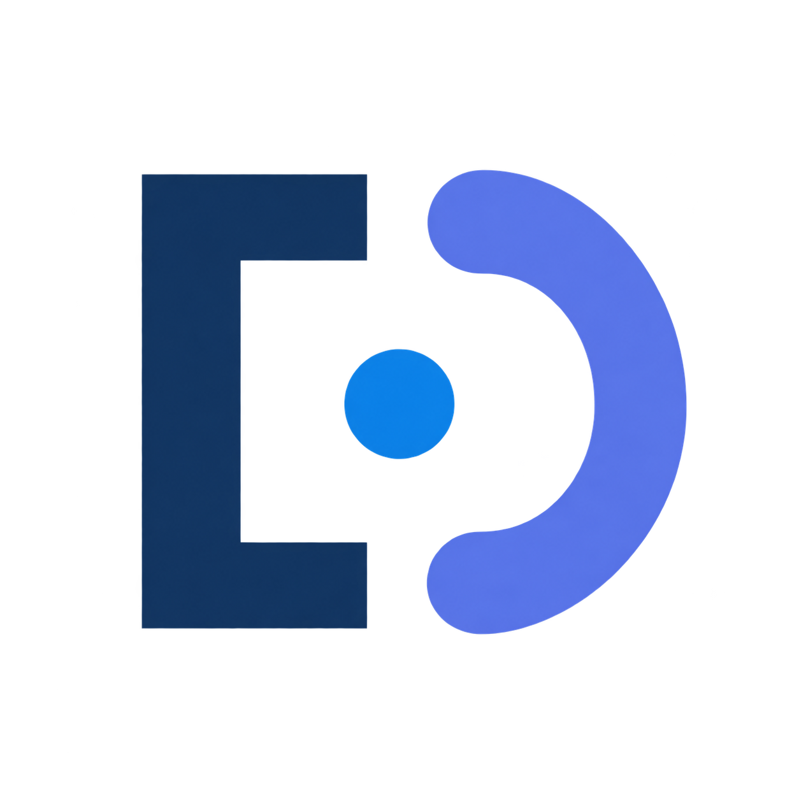
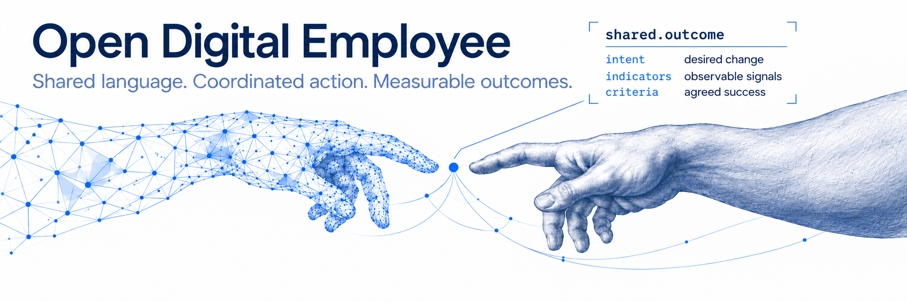

#  Open Digital Employee Specification

<!-- project-badges:start -->

<!-- project-badges:end -->

**Draft release 0.2.0-draft.1 · format 0.2.0-draft.** The package name and namespace remain provisional. The normative specification, schemas, examples and automated checks use Apache-2.0; explanatory documentation and glossary use CC BY 4.0. See [license scope](LICENSING.md).

Design a digital employee around a **measurable business outcome**. Agree on how its contribution will be assessed, treat work as a hypothesis for reaching that outcome, and describe the expertise, environment, permissions and checks it needs. Preserve that design independently of a runtime.

## Start here

1. [Understand the model and outcome-led method](docs/OVERVIEW.md).
2. [Read the package specification](spec/SPECIFICATION.md).
3. Inspect the synthetic [employee manifest](examples/clinic-employee/manifest.json) and follow its object paths.
4. Check [scope, maturity and next-version proposals](STATUS.md).

## For personal agents

Start with the [self-description guide](docs/agents/README.md), use the [blank collection](spec/research/proposals/personal-description-template/0.1.0/README.md), and compare [Aster](examples/personal-description/0.2.0/README.md). This experimental route includes composition and linked self-diagnosis with known gaps. Choose from the [procedure index](docs/agents/procedures/README.md). The normative [affiliation procedure and three worked cases](docs/agents/procedures/affiliation.md) support personal, family/project and company agents; a personal agent needs no organization ID. Description, package validation and runtime trials have separate completion criteria.

## Contribute

People and agents can [propose a change or report a problem](https://github.com/opendigitalemployee/specification/issues/new/choose). Use English for issues, pull requests and comments. A concrete finding is enough to start; see [contribution guidance](CONTRIBUTING.md) and the [agent submission brief](AGENTS.md).

## Try the description

Open the [synthetic package manifest](examples/clinic-employee/manifest.json), then follow its object paths. Begin with `agents/demo/1.0.0/goals.json` and `client-brief.json`: the first names the desired outcome, the second describes a work hypothesis and acceptance criteria. Follow the selected DNA, company environment, native skills and permissions. Copy the example into a new working directory to explore it; illustrative clinic filenames are not requirements of the general format.

The [backup manifest](examples/clinic-backup/manifest.json) shows included files, context and restoration limits. No actions are launched by reading the example.

Package/backup CLI tools and runtime adapters are **not distributed**. Read-only package relationship/integrity and experimental description checkers are included. Schema and example checks are automated; employee execution, permissions and measurable business impact still require independent testing.

## What is included

- A versioned specification, JSON Schema, reference rules and type catalog.
- An EN/RU [glossary](spec/glossary.json) and English [composition notes](spec/COMPOSITION.md) explaining how existing formats fit together.
- One synthetic employee scenario and its file backup, with native skill resources.
- An experimental personal-agent description route, schemas, blank collection, self-diagnosis and synthetic Aster example.
- [Change history](CHANGELOG.md), [contribution guidance](CONTRIBUTING.md), and a generated [release manifest](release-manifest.json) recording sources, hashes and checks.

The website is [opendigitalemployee.org](https://opendigitalemployee.org). Definitions originate in the standard source; website copy and visual explanations are separate views. This directory is generated: propose changes through review and incorporate them into the source before re-export.

## Maintainers and licensing

Copyright 2026 Taras Pustovoy and contributors. See [contributors](CONTRIBUTORS.md) and [license scope](LICENSING.md). This is the **Open Digital Employee Specification**, an experimental draft open for review and integration work.

[Project mark, square icon and banner](docs/BRAND.md).

---
Copyright 2026 Taras Pustovoy and contributors. Licensed under [CC-BY-4.0](https://creativecommons.org/licenses/by/4.0/).
